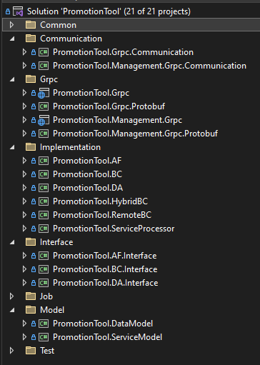

# Architecture and Design
- [Coding Architecture](#coding-architecture)
- [Folder Structure](#folder-structure)

## Coding Architecture
The project follows a modular architecture pattern, separating functionality into distinct modules and layers for maintainability and scalability. The architecture consists of the following components:

| File | Description |
| ------ | ------ |
| AF (Application Facade) | Handle the entire flow of business logic |
| BC (Business Component) | Implement the business logic of the application |
| DA (Data Access) | Abstract the logic required to access the underlying data stores |
| Hybrid BC |  |
| Remote BC |  |
| Grpc | For often used function like promotion transaction related function |
| Management Grpc | For less used function such as create promotion |
| Data Model |  |
| Service Model |  |

## Folder Structure

