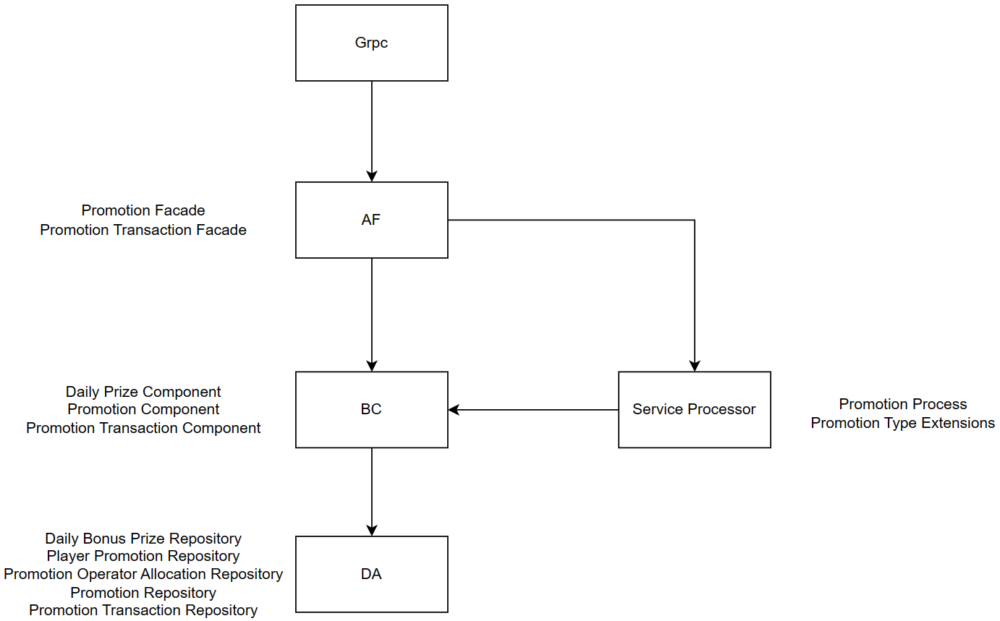

# Architecture and Design
- [Coding Architecture](#coding-architecture)
- [Folder Structure](#folder-structure)
- [Design Pattern](#design-patterns)

## Coding Architecture
The project follows a modular architecture pattern, separating functionality into distinct modules and layers for maintainability and scalability. The architecture consists of the following components:  

| File | Description |
| ------ | ------ |
| Grpc | *`type something here...`* |
| Management Grpc | *`type something here...`* |
| AF (Application Facade) | *`type something here...`* |
| BC (Business Component) | *`type something here...`* |
| DA (Data Access) | *`type something here...`* |
| Hybrid BC | *`type something here...`* |
| Remote BC | *`type something here...`* |
| Service Processor | *`type something here...`* |
| Data Model | *`type something here...`* |
| Service Model | *`type something here...`* |

 

<a href="https://viewer.diagrams.net/?page-id=zvAs8s11Rr8DDzGO9MPl&highlight=0000ff&edit=_blank&layers=1&nav=1&page-id=zvAs8s11Rr8DDzGO9MPl#G1tbxrTbyO1cFPmTHQ1eRPHUOAm7aWiNSt">hello</a>
 

## Folder Structure
`something here...`  

## Design Patterns
The project utilizes the following design patterns to promote code reusability and maintainability:

**MVC (Model-View-Controller)**:  
Separating the user interface (View), business logic (Controller), and data retrieval/storage (Model) responsibilities.

**Repository Pattern**:  
The data access layer uses the repository pattern to abstract data operations and provide a consistent interface for accessing data entities.

**Dependency Injection**:  
Dependency injection is employed to manage the dependencies between different components, allowing for loose coupling and easier testing.
