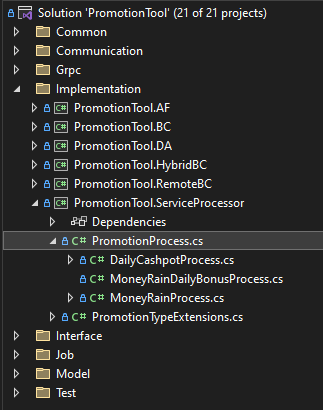

# Create New Promotion Guideline

Before starting develop new promotion, please make sure you have read and understand all the information below:
- [README](../README.md)
- [Development Setup](dev-setup.md)
- [Architecture Design](architecture-design.md)
- [C# Coding Standards](https://www.dofactory.com/csharp-coding-standards)

### Steps
1. Create new promotion file in PromotionProcess.cs under ServiceProcessor:  
      
2. Start to code the promotion logic in the file created.
3. 
